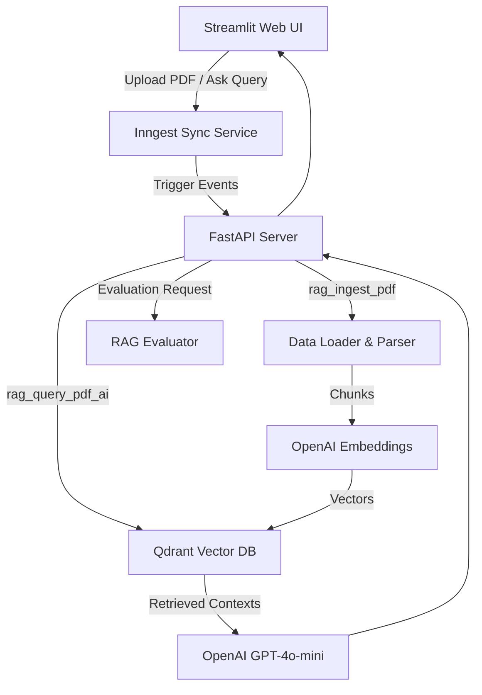

# Technical Documentation: Production-Grade RAG Python Application

**Document Status:** Final
**Author:** AI Engineer / Development Team
**Last Updated:** March 2026

---

## 1. Executive Summary

The Production-Grade Retrieval-Augmented Generation (RAG) Python Application is a robust, end-to-end system designed for ingesting PDF documents, performing semantic searches, and answering user queries using an AI model grounded in the retrieved context.

The system prioritizes reliability, scalability, and quality through the use of an event-driven asynchronous architecture (Inngest), a powerful vector database (Qdrant), industry-standard language models (OpenAI), and built-in on-demand quality evaluation mechanisms (RAGAS).

---

## 2. System Architecture

The application is structured into decoupled components to separate the user interface, workflow orchestration, data processing, and state management.

### 2.1 Component Breakdown

1. **Frontend Interface (`streamlit_app.py`)**: A Streamlit web application providing a user-friendly way to upload PDFs, submit queries, configure retrieval settings (e.g., `top_k`), and visualize evaluation metrics.
2. **API & Workers (`main.py`)**: A FastAPI server that exposes endpoints primarily consumed by the Inngest client to handle asynchronous task executions (ingestion and querying).
3. **Workflow Orchestrator (Inngest)**: Manages event queues, rate-limiting, retries, and task steps, ensuring robust execution of background processes even during failures.
4. **Data Processor (`data_loader.py`)**: Handles document parsing and text chunking using LlamaIndex, as well as vector embedding generation via OpenAI's APIs.
5. **Vector Storage (`vector_db.py`)**: Manages connections, collections, upserts, and similarity searches using Qdrant.
6. **Quality Evaluator (`rag_evaluator.py`)**: Wraps the RAGAS framework to evaluate RAG answers based on metrics such as faithfulness and context relevance.
7. **Data Models (`custom_types.py`)**: Defines Pydantic schemas for strong typing across components.

---

## 3. Technology Stack & Usage

| Technology | Purpose | Implementation Details |
| :--- | :--- | :--- |
| **Python 3.13+** | Core Language | Uses modern Python features and async programming. |
| **FastAPI** | Web Server | Hosts the webhook endpoints required by Inngest. |
| **Streamlit** | Frontend Web UI | Handles user interactions, file uploads, event triggers, and response visualization. |
| **Inngest** | Event Orchestration | Manages `rag/ingest_pdf` and `rag/query_pdf_ai` events. Provides throttling (2/min) and rate-limiting (1/4hrs per source). |
| **LlamaIndex** | Document Parsing | Utilizes `PDFReader` and `SentenceSplitter` (chunk size: 1000, overlap: 200 tokens). |
| **OpenAI API** | Embeddings & LLM | `text-embedding-3-large` (3072-dim) for embeddings; `gpt-4o-mini` for generation. |
| **Qdrant** | Vector Database | Stores 3072-dim vectors. Performs cosine similarity searches (`top_k`). |
| **RAGAS** | Answer Evaluation | Computes Faithfulness, Answer Relevance, Context Relevance, and Context Recall. |
| **Pydantic** | Data Validation | Ensures strict type-checking and standardized object payloads across modules. |

---

## 4. Key Workflows

### 4.1 Document Ingestion Flow (`rag/ingest_pdf`)

The ingestion process is completely decoupled from the UI to ensure the user does not wait for a long-running extraction process.

1. **Trigger**: User uploads a PDF. Streamlit saves it locally and fires a `rag/ingest_pdf` Inngest event.
2. **Throttling/Rate Limiting**: Inngest ensures a maximum of 2 ingestions per minute globally, and 1 per 4 hours per specific document.
3. **Execution Steps**:
   - `load-and-chunk`: `data_loader.py` uses `PDFReader` to read text, then `SentenceSplitter` breaks the text into 1000-token chunks.
   - `embed-and-upsert`: Generates 3072-dimensional vector embeddings via OpenAI. Vectors, along with text payloads and source IDs, are upserted into Qdrant.

### 4.2 Query and Generation Flow (`rag/query_pdf_ai`)

1. **Trigger**: User inputs a question and specifies the number of context chunks (`top_k`). Streamlit fires the `rag/query_pdf_ai` event.
2. **Execution Steps**:
   - `embed-and-search`: Embeds the user's question using `text-embedding-3-large`. Searches Qdrant for the `top_k` closest vectors (cosine distance).
   - `llm-answer`: Constructs a strict system prompt ("You answer questions using only the provided context") combined with the retrieved contexts. The prompt is sent to `gpt-4o-mini` (temperature: 0.2) via the Inngest AI SDK.
3. **Response**: The LLM's response, along with the source metadata, is returned. Streamlit polls Inngest for the task completion and displays the result.

### 4.3 On-Demand Evaluation Flow

To ensure the trustworthiness of the RAG system, users can trigger an evaluation of the LLM's answer.

1. **Trigger**: User clicks "Evaluate Answer" in Streamlit.
2. **Processing**: The application retrieves the `question`, `answer`, and `contexts` from the session state and passes them to `rag_evaluator.evaluate_query()`.
3. **Metrics Calculation**:
   - **Faithfulness**: Validates if the answer is completely backed by the retrieved context.
   - **Answer Relevance**: Checks if the answer directly addresses the original question.
   - **Context Relevance**: Measures how useful the retrieved contexts are for the question.
   - **Context Recall** (Optional): Assesses if the context captured all necessary information (if ground truth is present).
4. **Display**: Scores are returned as values from 0.0 to 1.0, formatted with color-coded status indicators (🟢 > 0.8, 🟡 > 0.6, 🔴 <= 0.6).

---

## 5. Data Models (`custom_types.py`)

The application enforces strong data boundaries using Pydantic models.

- **`RAGChunkAndSrc`**: Encapsulates parsed text chunks and their source identifier.
- **`RAGUpsertResult`**: Returns the count of successfully ingested vector chunks.
- **`RAGSearchResult`**: Contains the raw text `contexts` and the `sources` associated with the closest vectors.
- **`RAQQueryResult`**: The final output payload containing the generated `answer`, `sources`, and `num_contexts`.
- **`RAGEvaluationMetrics`**: Holds the floating-point results of the RAGAS evaluation.

---

## 6. Configuration & Environment

The application relies on several environment variables and hard-coded tuning parameters.

### 6.1 Environment Variables (`.env`)
- `OPENAI_API_KEY`: Required for Embeddings and LLM endpoints.
- `INNGEST_API_BASE`: Endpoint for the Inngest server (Defaults to local dev `http://127.0.0.1:8288/v1`).

### 6.2 Application Parameters
| Parameter | Location | Value | Description |
| :--- | :--- | :--- | :--- |
| `chunk_size` | `data_loader.py` | `1000` | Tokens per document chunk |
| `chunk_overlap`| `data_loader.py` | `200` | Overlap size to preserve context between chunks |
| `EMBED_DIM` | `data_loader.py`, `vector_db.py` | `3072` | Vector dimensionality |
| `top_k` | `main.py` / `vector_db.py` | `5` (default) | Default number of retrieved chunks |
| `temperature` | `main.py` | `0.2` | LLM hallucination control. Low = deterministic |
| `throttle_count`| `main.py` | `2` / `1m` | Global ingestion limit |
| `rate_limit` | `main.py` | `1` / `4h` | Per-document ingestion limit |

---

## 7. Deployment Considerations

To transition this application from development to production:

1. **Vector Storage**: Replace the local Qdrant container with Qdrant Cloud or a fully managed Kubernetes deployment with persistent volumes.
2. **Orchestration**: Transition from the local `inngest dev` server to the Inngest Cloud platform by providing appropriate Sync URLs and Keys.
3. **Web Server Deployment**: Run the FastAPI instance using a robust ASGI server (e.g., Uvicorn managed by Gunicorn) with multiple workers behind a load balancer.
4. **Security**: Ensure uploaded PDFs are stored in secured object storage (like AWS S3) rather than local `/uploads` to handle scale, and securely manage API keys.

---
*End of Documentation*
